# Arkive — App Screenshots

All screenshots captured via Playwright against a live Arkive instance with dark theme enabled (default).

## Setup & Onboarding

| Screenshot | Description |
|:-----------|:------------|
| 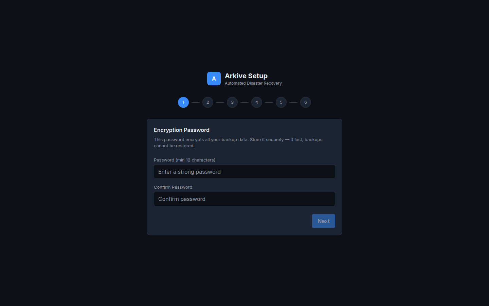 | **Setup Wizard** — 6-step guided onboarding: encryption password, storage targets, backup schedules, directories, notifications, and confirmation. |

## Dashboard & Core Views

| Screenshot | Description |
|:-----------|:------------|
| 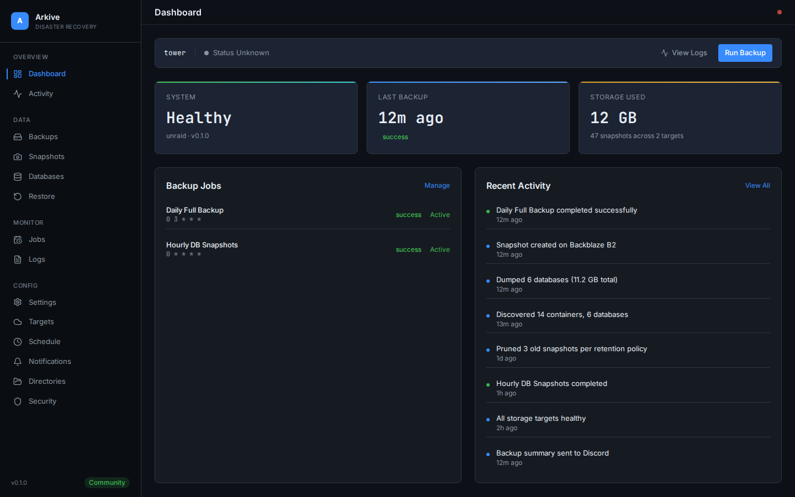 | **Dashboard** — System health, last backup time, discovered containers, storage usage, quick-action buttons, backup jobs list, and recent activity feed. |
| 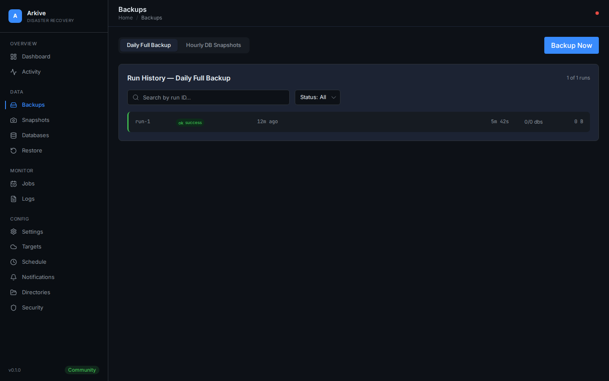 | **Backup Runs** — History of all backup executions with status badges, duration, trigger type (manual/scheduled), and size. |
| 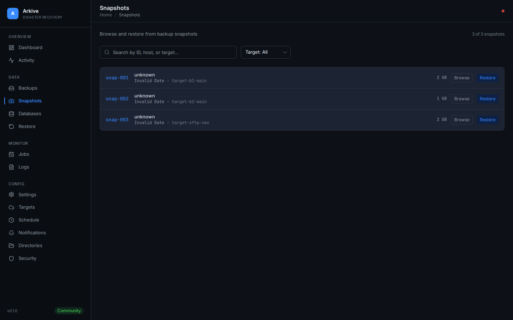 | **Snapshots** — Browse all restic snapshots across storage targets with filtering by date, target, and tags. |
| 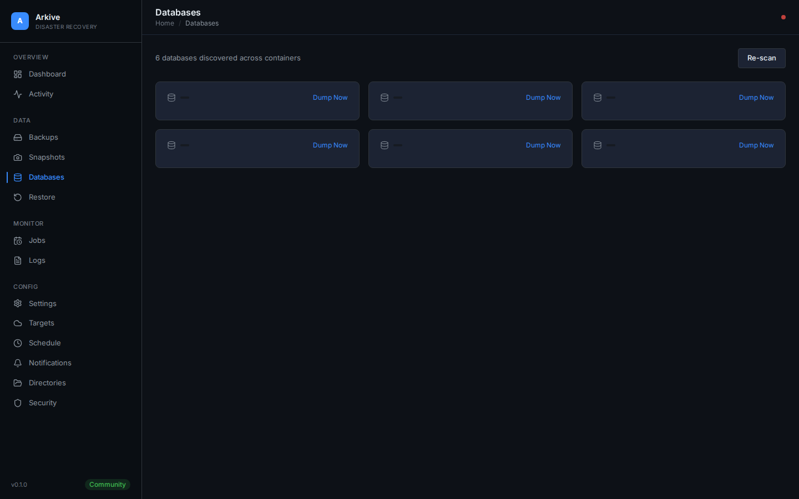 | **Databases** — Auto-discovered database containers (PostgreSQL, MariaDB, MongoDB, Redis, SQLite, InfluxDB) with type detection and backup status. |
| 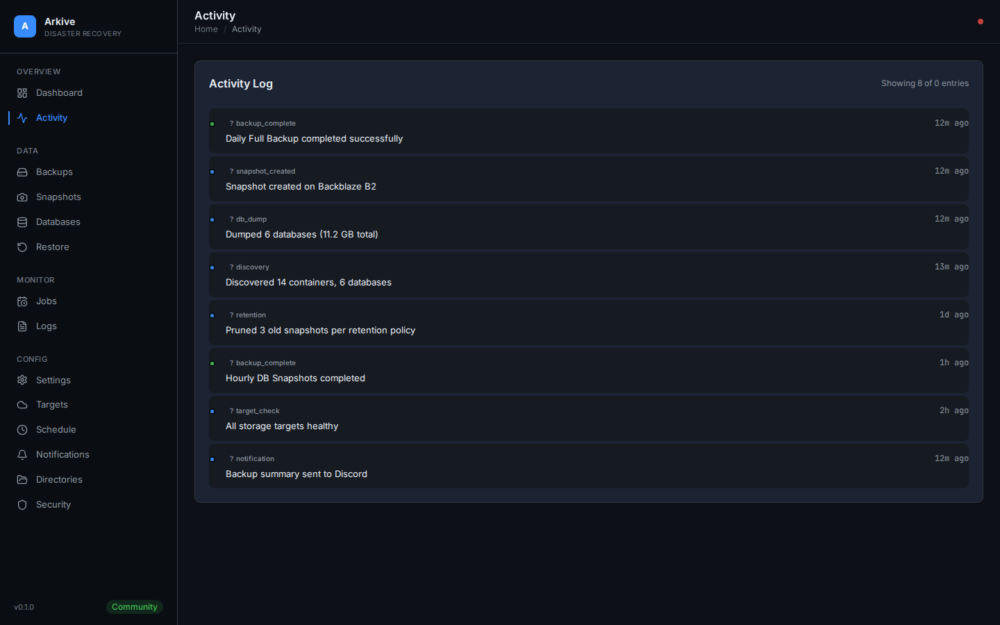 | **Activity Log** — Chronological feed of system events: backups, discoveries, configuration changes, errors. |
| 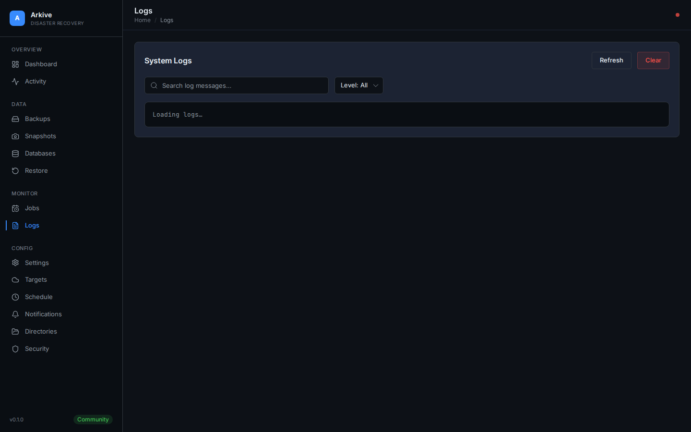 | **System Logs** — Structured log viewer with level filtering (DEBUG, INFO, WARNING, ERROR) and real-time streaming. |

## Restore & Recovery

| Screenshot | Description |
|:-----------|:------------|
| 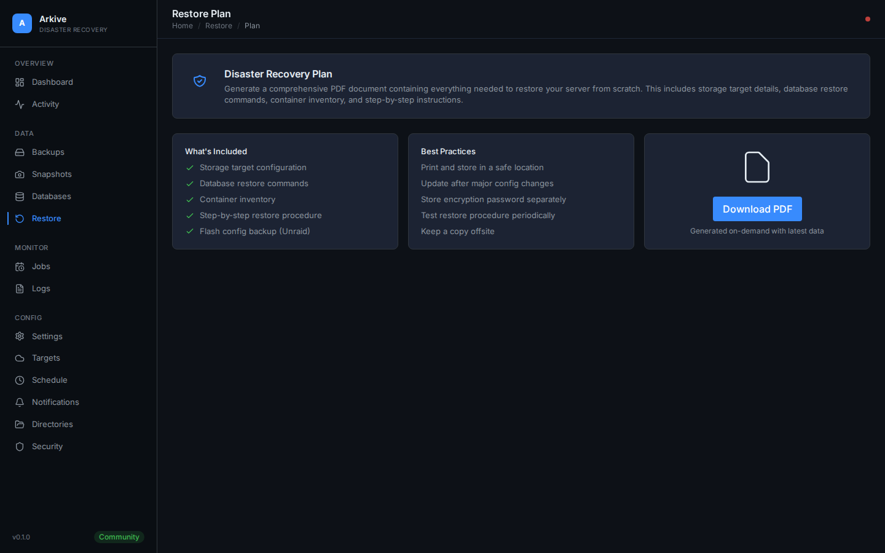 | **Restore** — Browse snapshots and select files/databases to restore. Supports full and granular restores with step-by-step recovery guidance. |

## Settings

| Screenshot | Description |
|:-----------|:------------|
| 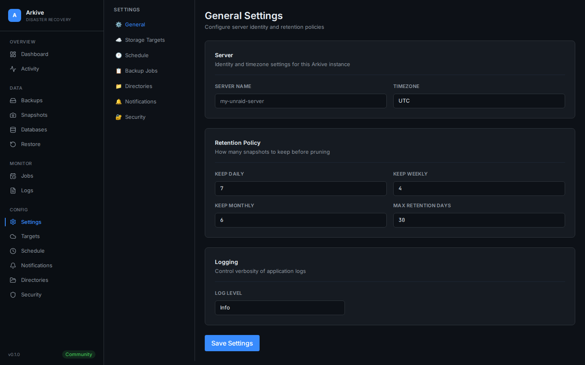 | **General** — Server name, timezone, log level, theme selection (dark/light), and data management. |
| 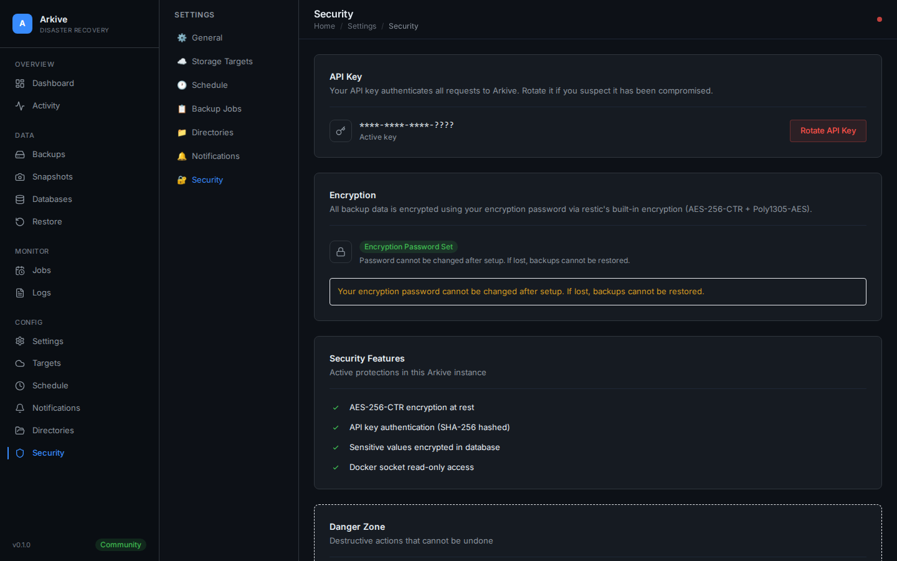 | **Security** — API key management with rotation, AES-256-CTR encryption status, and security features checklist. |
| 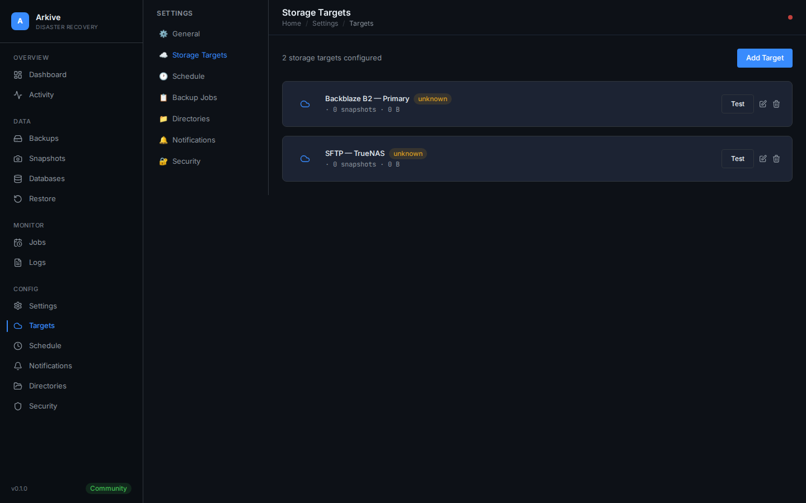 | **Storage Targets** — Configure Backblaze B2, AWS S3, SFTP, or local storage with restic repository initialization. |
| 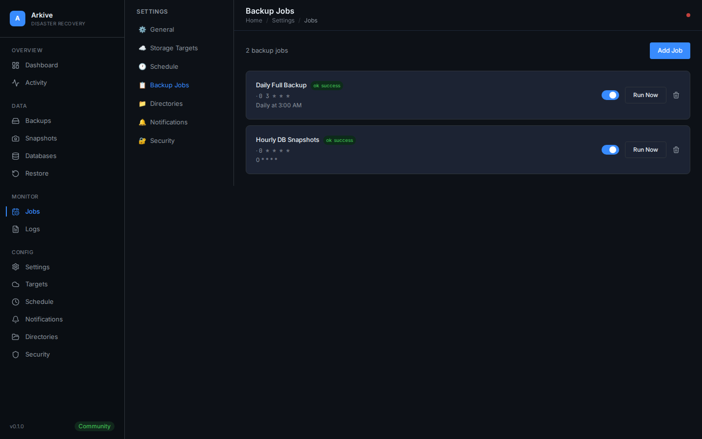 | **Backup Jobs** — Create and manage backup job definitions with type selection, cron schedules, and directory scoping. |
| 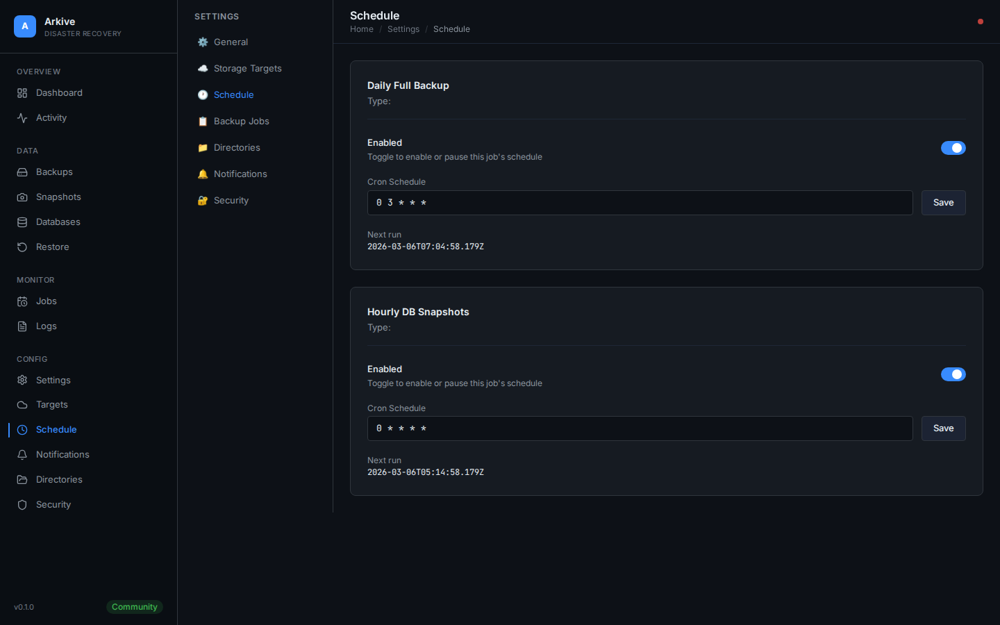 | **Schedule** — Visual cron schedule editor for all backup types (DB dumps, cloud sync, flash backup) with next-run preview. |
| 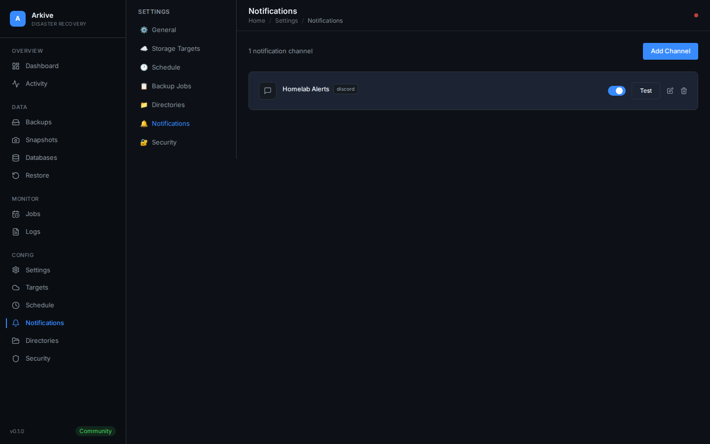 | **Notifications** — Configure Discord, Slack, and ntfy webhook channels with per-event filtering and test delivery. |
| 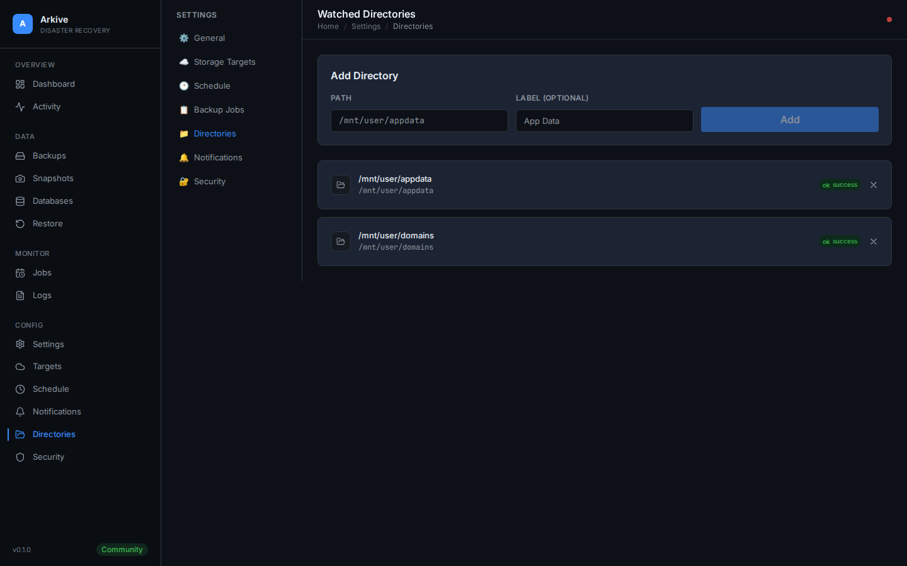 | **Directories** — Manage backup directories with scan operations for automatic content discovery. |

---

*Screenshots auto-generated with [Playwright](https://playwright.dev) against Arkive v0.1.0.*
